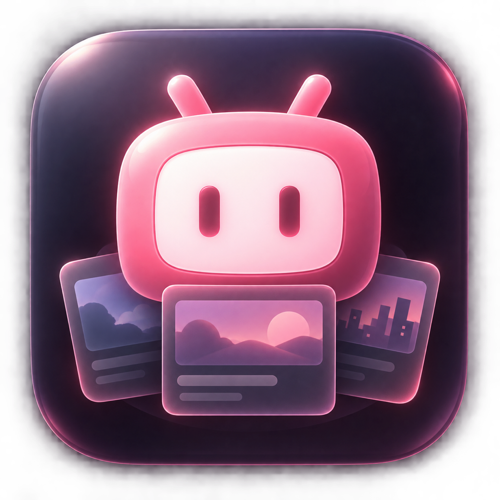

<div align="center">
  
  <h1>BiliDesk</h1>
  <p>把 bilibili 推荐、历史、收藏与稍后再看放到 macOS 桌面。</p>

  [](https://www.apple.com/macos/)
  [](https://www.swift.org/)
  [](LICENSE)
</div>

## 项目简介

BiliDesk 是一个原生 SwiftUI macOS 应用和 WidgetKit 桌面小组件。它直接从 bilibili 获取首页推荐；登录后还可以显示历史记录、默认收藏夹和稍后再看。点击任意视频卡片，会把对应播放页交给系统默认浏览器打开。

项目不使用自建中转服务器。登录凭证保存在 macOS 钥匙串，内容快照与缩略图缓存在应用和小组件共享的本地容器中。

## 主要功能

- 小、中、大、超大四种 macOS 桌面小组件。
- 首页推荐与“换一批”刷新。
- 使用 bilibili 手机客户端扫码登录。
- 登录后同步历史记录、默认收藏夹与稍后再看。
- 点击小组件视频，直接使用默认浏览器打开播放页。
- 超大号视频看板，兼顾封面、标题和个人片单的可读性。
- 可自由缩放的独立桌面看板，支持驻留桌面、普通窗口和保持置顶。
- 登录后作为菜单栏后台助手运行，不常驻 Dock。
- 深色界面与 macOS Liquid Glass 强调色适配。
- 封面本地缓存；短暂断网时保留最近一次成功内容。

## 下载与安装

在仓库右侧的 **Releases** 页面下载 `BiliDesk-2.7.dmg`：

1. 打开 DMG。
2. 将 `BiliDesk` 拖入 `Applications`。
3. 首次打开后，按提示使用 bilibili 手机客户端扫码。
4. 右键桌面并选择“编辑小组件”，搜索“Bili 桌面推荐”。

> [!WARNING]
> 当前 DMG 是使用 Apple Development 个人开发证书签名的开源预览版，没有经过 Apple Developer ID 公证。证书和桌面小组件能力可能无法在所有 Mac 上通用。若 macOS 阻止首次启动，可在 Finder 中右键应用并选择“打开”。为了让桌面小组件稳定使用，推荐按照下方步骤使用自己的 Apple Team 从源码构建。

## 从源码构建

### 环境要求

- macOS 14 或更高版本
- Xcode 16 或更高版本（工程使用 Swift 6）
- 已登录 Xcode 的 Apple ID；桌面小组件需要可用的 Personal Team 或 Developer Team

### 构建步骤

1. 克隆仓库：

   ```bash
   git clone https://github.com/ibka512/BiliDesk.git
   cd BiliDesk
   open BiliDesk.xcodeproj
   ```

2. 在 Xcode 中依次选择 `BiliDesk` 和 `BiliDeskWidget` 两个 Target。
3. 在 **Signing & Capabilities** 中，为两个 Target 选择同一个 Team。
4. 若 Bundle Identifier 已被占用，请把主应用与小组件的标识改成自己的唯一值，并确保两者继续使用同一个 App Group。
5. 选择运行目标 `My Mac`，然后按 `Command-R`。
6. 应用运行一次后，即可在 macOS 的小组件图库中添加 BiliDesk。

未配置签名时，也可以执行仅编译检查：

```bash
xcodebuild \
  -project BiliDesk.xcodeproj \
  -scheme BiliDesk \
  -configuration Debug \
  -destination 'platform=macOS' \
  CODE_SIGNING_ALLOWED=NO \
  build
```

## 使用方式

- 小组件右上角按钮用于刷新推荐。
- 点击视频封面或标题会直接打开浏览器播放页。
- 登录后可通过菜单栏图标打开主界面、视频看板或退出后台助手。
- 独立看板默认尺寸为 960 × 560，并会记住窗口位置与大小。
- 收藏栏目目前读取默认收藏夹的最近内容。
- 退出登录会清除钥匙串中的登录凭证和本地个人内容缓存。

## 隐私与数据

- 登录 Cookie 保存在 macOS 钥匙串中，不写入 Git 仓库。
- 推荐、历史、收藏、稍后再看和封面缓存保存在本机共享容器中。
- 网络请求由应用直接发送给 bilibili，不经过项目作者的服务器。
- 本项目没有接入广告、统计 SDK 或第三方崩溃收集服务。

## 项目结构

```text
BiliDeskApp/       macOS 主应用、登录和独立看板
BiliDeskWidget/    WidgetKit 桌面小组件
Shared/            API、数据模型、缓存、钥匙串和共享视图
BrandAssets/       应用图标源文件与 1024px 成品
BiliDesk.xcodeproj Xcode 工程
```

## 已知限制

- 项目使用 bilibili 网页端接口，仅用于个人学习和自用；接口发生变化时相关功能可能失效。
- macOS 决定系统小组件的后台刷新时机，因此定时刷新不保证精确发生。
- 当前公开 DMG 未经过 Apple 公证，公开分发能力不等同于 Mac App Store 或 Developer ID 正式发行版本。
- 登录状态、推荐结果和个人列表均受 bilibili 账号与服务状态影响。

## 开源许可

源码使用 [MIT License](LICENSE) 发布。

BiliDesk 是独立的非官方开源项目，与哔哩哔哩（bilibili）没有隶属、授权或合作关系。bilibili 名称、商标及相关内容版权归其权利人所有。
